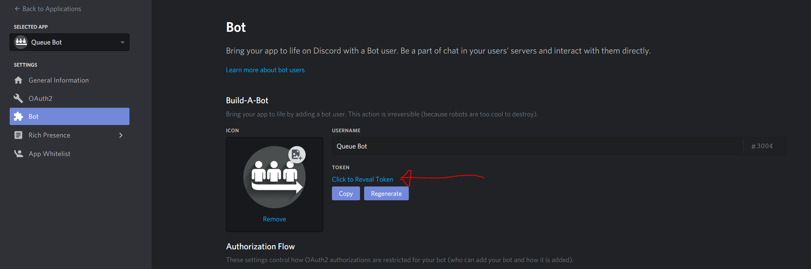

# Debate-Queue-Bot
## Setup
1. [Create your Discord bot account](https://discordpy.readthedocs.io/en/latest/discord.html)
2. Clone/download this repository
3. Modify `config.json`:  

| Parameter           | Description                                                                                                                       |
|---------------------|-----------------------------------------------------------------------------------------------------------------------------------|
| `prefix`            | Command prefix (Default: `!`)                                                                                                     |
| `token`             | Bot token. Found in the Discord Developer Portal for the bot you created in Step 1. See image of token location below this table. |
| `database_type`     | Type of database for queue storage. (Default: `postgresql`)                                                                       |
| `database_uri`      | Database URI. (Example: `localhost:5432/YOUR_TABLE_NAME`)                                                                     |
| `database_username` |                                                                                                                                   |
| `database_password` | ` ` for no password.                                                                                                                                  |

  
